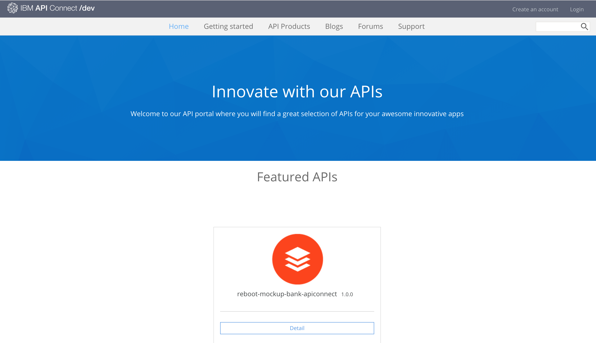
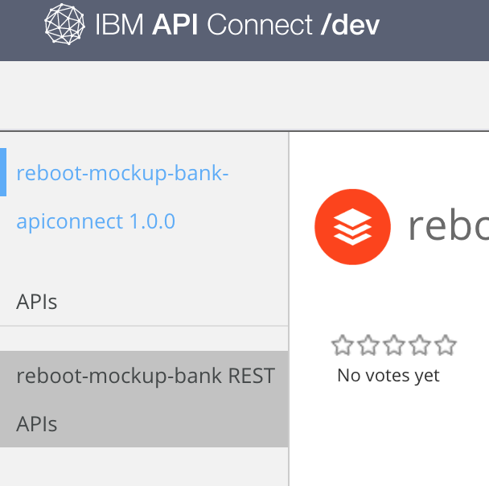
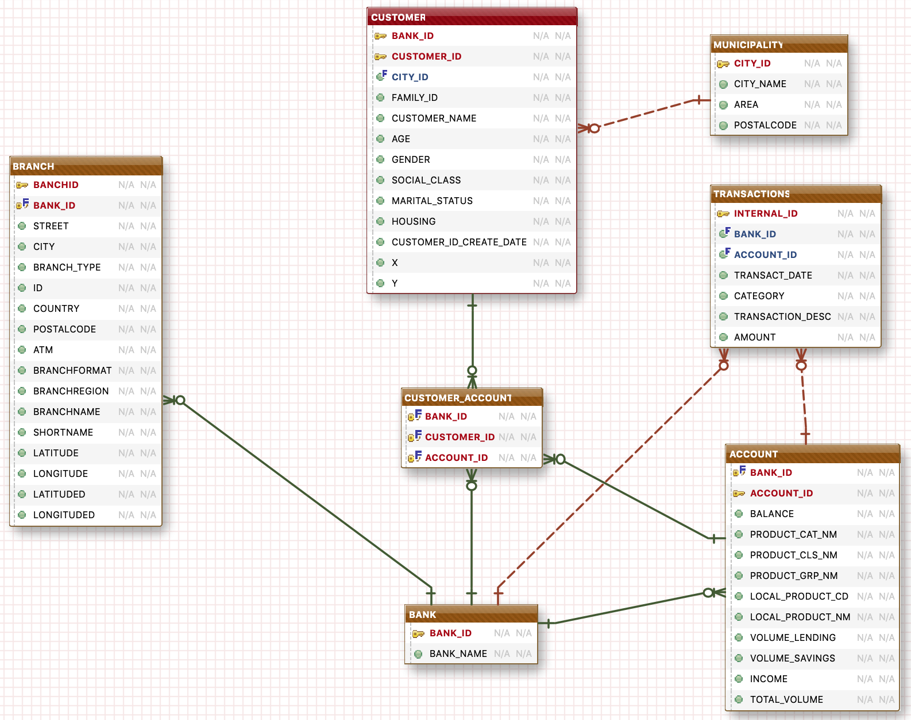

# Lloyds Bank Hackathon Reboot 4

## IBM Mockup Bank
All you need to know about the fictious **Banking Data Model &amp; APIs** for the Hackathon.

This page will provide high level documentation, the basics and links to get to the **APIs** and more detailed documentation.

+ Detailed doumentation of the Data Model is [here](datamodel/DataModel.md)
+ Detailed documentation of the **IBM API Connect APIs** is [here](mockupbank-api-doc.md)
---

The **API developer portal** for the Mockbank is provided by **IBM API Connect** at
https://sb-bsc-7-px-lb-2019.developer.eu.apiconnect.ibmcloud.com/

> **Note:** the above URL is the portal which will allow you to test the APIs and the domain for all the APIs for the *MockupBank application*.

This is the landing page of the **IBM API Connect Portal**.

This lets developers explore the APIs that are available, the required and optional parameters, and schema for responses.

You'll find the Mockbank API through the `API Products` and selecting the `reboot-mockup-bank-apiconnect`.
> **Note:** an **IBM API Connect** product is a published version of a series of API. It is a conceptual packaging of the APIs for improved management.  

The list of APIs is available by clicking on the `reboot-mockup-bank REST APIs` link from the left side bar or at the following URL: https://sb-bsc-7-px-lb-2019.developer.eu.apiconnect.ibmcloud.com/node/101  

---
The **Data Model** is a simplistic one based on Customers, Accounts and Transactions.

The provided data is based on the following schema which is an extract of a larger data model.

More details about the data model and its entities is available [here](datamodel/DataModel.md)
